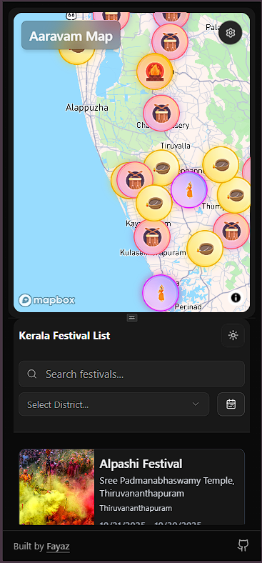
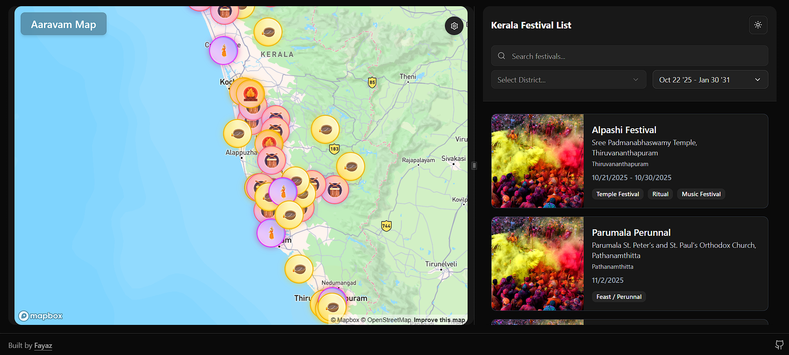
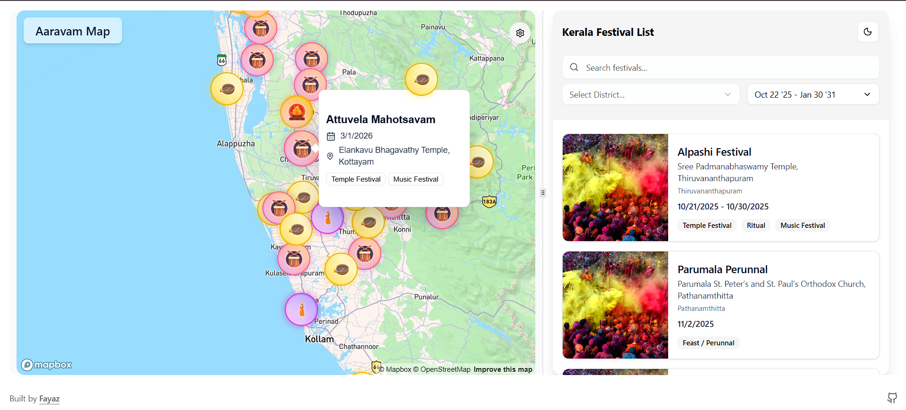

#  Kerala Local Festival Map (Frontend)

A React-based interactive map application that displays **local festivals in Kerala**.
Users can explore festivals across the state, filter by district, search by name, and view events within specific date ranges — all visualized beautifully on a dynamic map.

---

##  Features

-  **Festival Listing** – Displays upcoming and past local festivals across Kerala.
-  **District Filtering** – Filter festivals based on selected districts.
-  **Search by Name** – Quickly find a specific festival by typing its name.
-  **Date Range Filtering** – View festivals happening within a custom date range.
-  **Dynamic Map Updates** – The map automatically updates to show festivals that match your filters.
-  **Fast** – Built with React, TypeScript, and TailwindCSS for an optimized frontend experience.

---

##  Tech Stack

| Category             | Technology                  |
| -------------------- | --------------------------- |
| **Framework**        | React + TypeScript          |
| **Styling**          | Tailwind CSS                |
| **Map Integration**  | Mapbox                      |
| **State Management** | Tanstack Query / Context    |
| **Data Source**      | JSON-based festival dataset |

---

## 📸 Project Screenshots





---

##  Installation & Setup

1. **Clone the repository**

   ```bash
   git clone https://github.com/MuhammedFayazTS/kerala-festival-map-frontend.git
   ```

2. **Navigate to the project directory**

   ```bash
   cd kerala-festival-map-frontend
   ```

3. **Install dependencies**

   ```bash
   pnpm install
   ```

4. **Run the development server**

   ```bash
   pnpm run dev
   ```

5. Open your browser and visit
    [http://localhost:5173](http://localhost:5173)

---

##  Disclaimer

> The festival data is collected from the **Kerala Tourism Calendar (2025–2026)**.
> Festival dates may vary based on regional or religious calendars (e.g., Islamic, Hindu lunar dates).
> This is a **basic version** — more features and data improvements are under active development.

---

##  Contributing

Contributions are welcome!
If you’d like to improve this project:

1. Fork the repository
2. Create a new branch (`feature/your-feature-name`)
3. Commit your changes
4. Open a Pull Request

---

##  License

This project is licensed under the **MIT License**.
